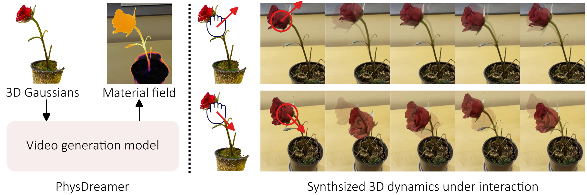

# PhysDreamer: Physics-Based Interaction with 3D Objects via Video Generation [[website](https://physdreamer.github.io/)]



## Useage

### Setup enviroment

Install diff-gaussian-rasterization at: https://github.com/graphdeco-inria/diff-gaussian-rasterization
   
```bash
conda create -n physdreamer python
conda activate physdreamer

pip install -r requirements.txt

python setup.py install
```

### Download the scenes and optimized models from Hugging Face

Download the scenes and optimized velocity and material fields from: https://huggingface.co/datasets/YunjinZhang/PhysDreamer/tree/main

Put folders of these scenes to `data/physics_dreamer/xxx`, e.g. `data/physics_dreamer/carnations`

Put pretrained models to `./models`. 

See `dataset_dir` and `model_list` in  `inference/configs/carnation.py` to match the path of dataset and pretrained models. 


### Run inference

```bash
cd projects/inference
bash run.sh
```


## Acknowledgement
This codebase used lots of source code from: 
1. https://github.com/graphdeco-inria/gaussian-splatting
2. https://github.com/zeshunzong/warp-mpm
3. https://github.com/PingchuanMa/NCLaw

We thank the authors of these projects.


## Citations
```
@article{zhang2024physdreamer,
    title={{PhysDreamer}: Physics-Based Interaction with 3D Objects via Video Generation},
    author={Tianyuan Zhang and Hong-Xing Yu and Rundi Wu and
            Brandon Y. Feng and Changxi Zheng and Noah Snavely and Jiajun Wu and William T. Freeman},
    journal={arxiv},
    year={2024}
}
```
